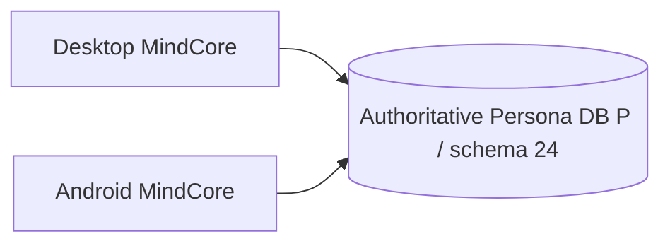

# Desktop Persona storage architecture

## M7.3.3-A shared Persona storage foundation (candidate)

The target product architecture uses one user-owned schema-24 Persona
database. Desktop and Android connect directly to it with the same immutable
`persona_id`:

`LOCAL_ONLY` keeps one local SQLite file authoritative on that device and does
not upload it. `SHARED` uses a configured remote libSQL/Turso database as the
only durable Persona authority. Desktop's existing `TursoPool` supports both
`file:` and remote `libsql:` connections; `app.database.persona_storage`
classifies those URLs and atomically binds the existing `schema_metadata`
identity key `mindcore_persona_id` without changing schema 24. Android uses a
stdlib Hrana HTTP v2 adapter over verified TLS.

The foundation is not accepted as a product runtime yet. The desktop setup
currently persists `DATABASE_AUTH_TOKEN` in its per-persona environment file
instead of exclusively in the OS keyring. Same-database product E2E with the
Android runtime, real cognition visibility, restart, concurrency and failure
injection also remain unproven. Consequently capability markers remain false;
see [the M7.3.3-A report](M7_3_3_DESKTOP_SHARED_PERSONA_DB_REPORT.md).

### Historical replica-sync candidate

M7.3.2 through M7.3.2.1.3 explored manual file-based device-replica sync. Their
code, architecture details, and FAIL reports remain in the repository as
historical evidence. `.mindcorepair`/`.mindcoresync`, replica conflict handling,
and manual transport are not required by the shared-runtime design and do not
establish shared database acceptance.

## Deferred product work

PC v0.4.0 + Android release will address Half-login/PersonaBindingGuard,
Persona mismatch UX, the Blue/Teal design system, the neural-core boot screen,
legacy Sync/Devices UI cleanup, and the final Persona connection UI. This
foundation milestone does not implement those flows, autonomy, background
runtime, or notifications.
