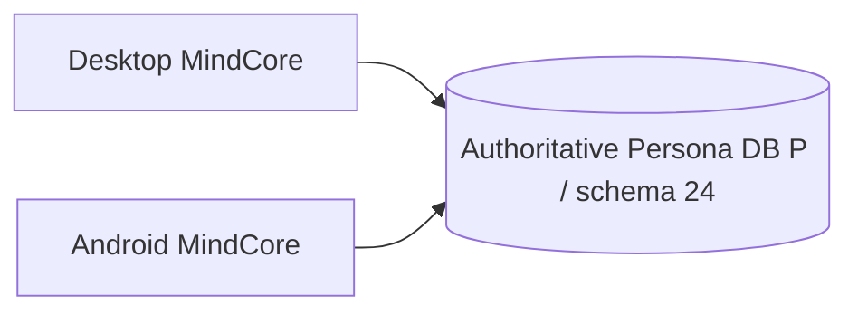

# M7.3.3-A Desktop Shared Authoritative Persona DB Report

**Verdict: FAIL / NO-GO**  
**Date:** 2026-09-29  
**Desktop baseline:** `43322b9030a2994a01fa81abd8978fcb9b2a8d9c`  
**Branch:** `feature/m73-desktop-sync`  
**Schema:** 24

## Summary

Desktop already supports local `file:` and remote `libsql:`/Turso Persona
databases through `TursoPool`. This milestone adds a storage-mode classifier
and binds the configured Persona UUID into the existing `schema_metadata`
table as `mindcore_persona_id`. No schema change is required. Service-database
backends are labeled separately from Persona `LOCAL_ONLY` so a Supabase
service DB is not misreported as a device-local Persona database.

The desktop foundation is **not accepted**. Database auth tokens are still
persisted in per-persona environment files rather than exclusively in the OS
keyring, and Desktop has not been run against the same synthetic authoritative
database as Android. The paired Android report is
`docs/M7_3_3_A_SHARED_PERSONA_DB_REPORT.md` in the Android repository.

## Architecture

Target architecture:

This replaces replica-sync as the target for shared Personas. `LOCAL_ONLY`
uses one local SQLite DB as device authority and is never uploaded
automatically. `SHARED` uses a user-configured remote libSQL/Turso database as
the single durable Persona authority. Desktop adapter is the existing
`TursoPool`; `persona_storage.py` verifies/claims the same canonical Persona ID
using a transaction on the existing schema metadata table.

Current behavior does not eliminate all legacy manual replica-sync code from
the repository or prove the shared workflow. M7.3.2 through M7.3.2.1.3 reports
remain historical FAIL records and have not been rewritten. No `.mindcorepair`
or `.mindcoresync` artifact was used in this milestone's synthetic adapter
tests.

## E2E, identity and durability

No synthetic remote endpoint credentials were configured, so these product
checks were not run:

- Desktop → Android and Android → Desktop durable row visibility.
- Same authoritative DB and same `persona_id` asserted by both product clients.
- Separate Desktop/Android `device_id` values asserted against one Persona.
- Cognition/memory visibility, restart continuity, and a concurrent append.
- Loss/duplicate counts, provider replay and post-cognition replay.
- DB unavailable followed by reconnect, proving no local fork.

`test_persona_storage.py` covers the URL mode classifier and immutable
`mindcore_persona_id` binding, including mismatch rejection. It uses a
synthetic database fixture and does not replace Desktop↔Android product E2E.

## Security and schema

- **Schema:** 24; no schema fork.
- **DB auth token:** current Rust setup code writes `DATABASE_AUTH_TOKEN` to
  profile environment config and reads it back from there. This fails the
  required OS-keyring-only storage criterion.
- **Provider keys:** remain device/profile local; they are not stored in the
  Persona DB by this change.
- **Transport:** Desktop's remote Turso driver is selected by configured
  `DATABASE_BACKEND=turso`; product TLS/security acceptance against a synthetic
  shared endpoint was not run.
- No production database, production credential, updater secret or signing key
  was accessed.

## Validation

| Area | Result |
| --- | --- |
| Desktop Python suite | 625 PASS, 1 skipped |
| Focused Persona storage tests after final mode label change | 3/3 PASS |
| Desktop frontend | 98/98 PASS |
| Frontend production build | PASS |
| Rust/Tauri unit suite | 60/60 PASS |
| PyInstaller sidecar build | PASS, 25,974,768 bytes |
| Tauri release app build (`--no-bundle`) | PASS, 17,468,544 bytes |
| Same DB as Android product runtime | Not run |

## Repository state and decision

The required Desktop baseline and branch were retained. Existing dirty M7.3.2
candidate work and historical reports were preserved. No reset, clean, stash,
restore, rebase or amend was used. Final `git diff --check` **PASS**. The
credential-pattern scan of 59 changed paths reported **0 findings**
(private-key block, AWS access key, OpenAI-style key, GitHub token). This scan
does not cure the database-token plaintext storage design described above. No
commit, push, tag or release was made.

**FAIL / NO-GO:** OS keyring storage for the database token and the synthetic
cross-platform same-database product E2E are required before shared Persona
capability markers can be enabled.

Deferred to PC v0.4.0 + Android release: Half-login/PersonaBindingGuard,
Persona-ID mismatch UX, Blue/Teal design system, neural-core boot screen,
legacy Sync/Devices UI cleanup, and final Persona connection UI. Autonomy,
background runtime, and notifications are outside this milestone.
